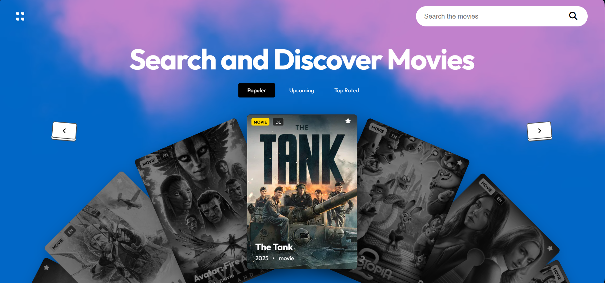

# <a href="https://moviio.vercel.app" target="_blank">Moviio - Discover Movies, Watch Youtube Trailers </a>

**Moviio** is a modern, interactive movie discovery web app powered by **TMDB**. Browse popular, top-rated, and upcoming movies, search by title, swipe or drag through a smooth **3D-style cinematic carousel**, and instantly watch official trailers in a fullscreen movie-theater overlay.

Built for **speed, motion, and immersion** — all running entirely in the browser.

<p align="left">
  <a href="./LICENSE">
    
  </a>
  
  
  <a href="https://github.com/byllzz">
    
  </a>
  <a href="https://github.com/byllzz/moviio/releases">
    
  </a>
</p>
<br />

[](https://moviio.vercel.app)



⭐ **Star the repo if you like it — it really helps!**

---

#  Features

<p align="left">
✔️ Interactive Movie Carousel (7-card cinematic layout)<br>
✔️ Drag / Swipe Navigation (mouse, touch & pointer-based)<br>
✔️ Smooth Animations & Transitions (GPU-optimized)<br>
✔️ TMDB-Powered Data (popular, top-rated & upcoming movies)<br>
✔️ Instant Search with Debounce (no reloads)<br>
✔️ Filter Tabs with Animated Indicator<br>
✔️ Infinite Movie Loading (auto prefetching)<br>
✔️ Trailer Playback Overlay (YouTube No-Cookie)<br>
✔️ Auto-Quality Trailer Playback (HD / 4K capable)<br>
✔️ Movie Metadata (rating, year, language, type)<br>
✔️ Client-Side Caching (faster repeat searches)<br>
✔️ Keyboard, Mouse & Touch Friendly<br>
✔️ No Accounts, No Tracking, No Backend UI<br>
✔️ Deployed on Vercel (serverless API proxy)
</p>

---

##  How It Works

- Uses a **custom 7-card carousel engine** (no libraries)
- Fetches movie data from **TMDB via a serverless API**
- Keeps UI smooth by:
  - Reusing cards
  - Limiting DOM nodes
  - GPU-friendly transforms
- Automatically preloads upcoming pages for **instant scrolling**
- Trailers are fetched dynamically and played using the **YouTube IFrame API**
- All interactions happen **client-side**, keeping it fast and responsive

---

##  Installation & Setup

### Requirements
- Node.js (for API proxy)
- Browser (Chrome / Edge / Firefox)
- TMDB API Key
- TMDB_API_KEY=your_tmdb_api_key_here


### Clone the Repository
```bash
git clone https://github.com/byllzz/moviio.git
cd moviio
```

# License 📄

This project is licensed under the MIT License - see the [LICENSE.md](./LICENSE) file for details.


# Feedback 

Reach out at **bilalmlkdev@gmail.com**. If you like this project, please ⭐ star the repo — it motivates future updates!
